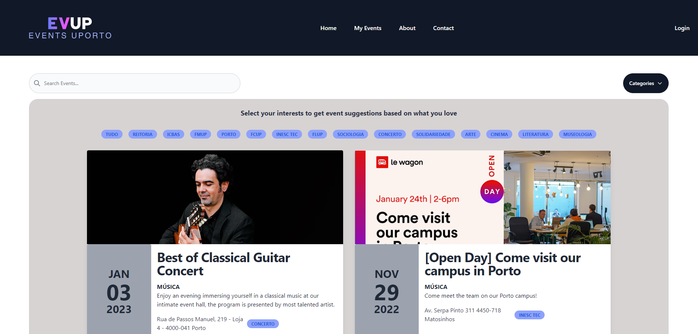
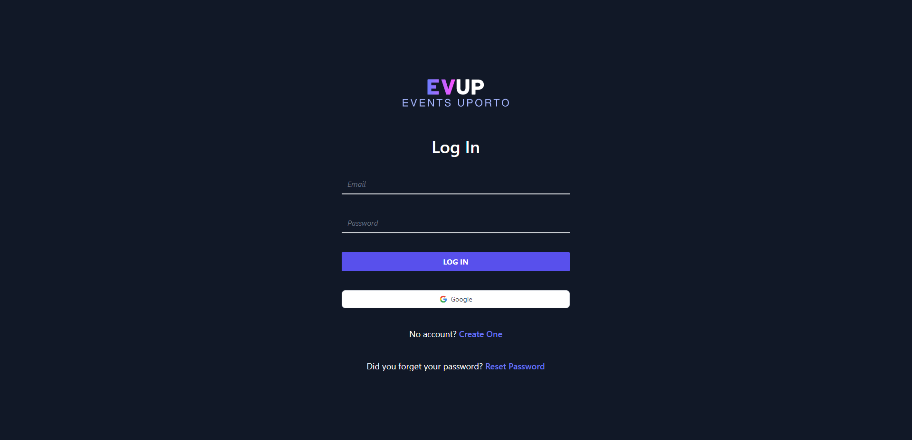
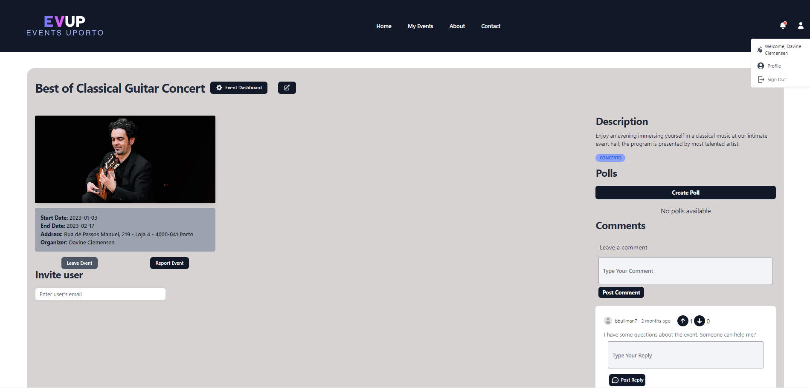
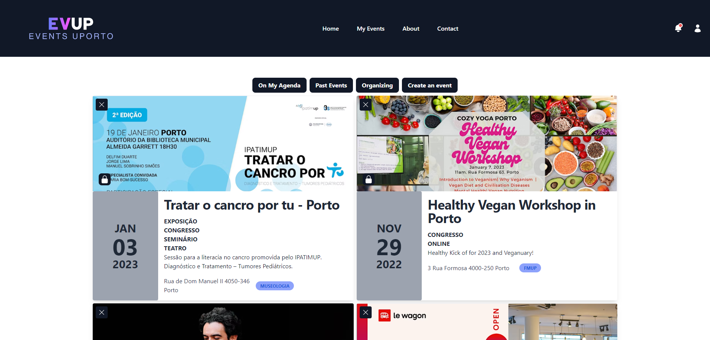

# EVUP

> EVUP (Events UP) is a project developed by a group of Informatics Engineering Students who consider that the management of University related events is significantly lacking in terms of usage and accessibility for students and event organizers.

## Project Components

* [ER: Requirements Specification](https://github.com/DanielaTomas/LBAW_FEUP/wiki/er)
* [EBD: Database Specification](https://github.com/DanielaTomas/LBAW_FEUP/wiki/ebd)
* [EAP: Architecture Specification and Prototype](https://github.com/DanielaTomas/LBAW_FEUP/wiki/eap)
* [PA: Product and Presentation](https://github.com/DanielaTomas/LBAW_FEUP/wiki/pa)

## Screenshots







## Installation

```
docker run -it -p 8000:80 --name=lbaw2252 -e DB_DATABASE="lbaw2252" -e DB_SCHEMA="lbaw2252" -e DB_USERNAME="lbaw2252" -e DB_PASSWORD=CFKrQZJB git.fe.up.pt:5050/lbaw/lbaw2223/lbaw2252
```

## Usage

> URL to the product: https://lbaw2252.lbaw.fe.up.pt/

### Administration Credentials

| Email | Password |
|-------|----------|
| admin@evup.com | 1234 |

### User Credentials

| Type | Email | Password |
|------|-------|----------|
| basic account | user@evup.com | 1234 |
| event organizer | organizer@evup.com | 1234 |
| blocked account | blocked@evup.com | 1234 |

## Team

* Daniela Tomás, up202004946@edu.fc.up.pt
* Hugo Almeida, up202006814@edu.fe.up.pt
* José Miguel Isidro, up202006485@edu.fe.up.pt
* Sara Moreira Reis, up202005388@edu.fe.up.pt

***
GROUP2252, 2022/2023
